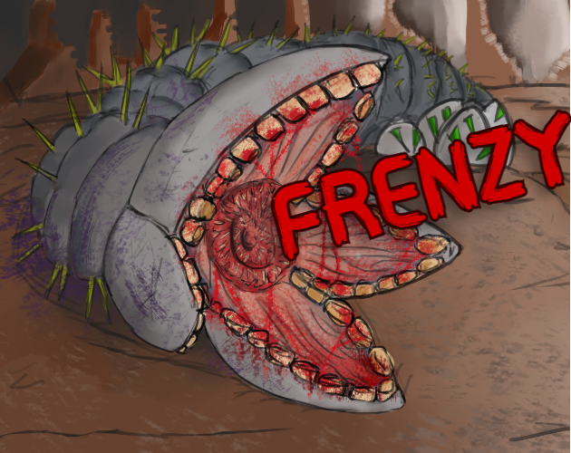

*Frenzy* is a top-down extermination type game that I created over the course
of 2022. You play as a gigantic sandworm, Gaia who has woken up after thousands
of years trapped in ice to find her wormlings missing. The world is very hostile
compared to Gaia's time, and she must carve her way through the resistance to
find her wormlings.

A link to the project on Github is available [here](https://github.com/bradley-mcfadden/worms).